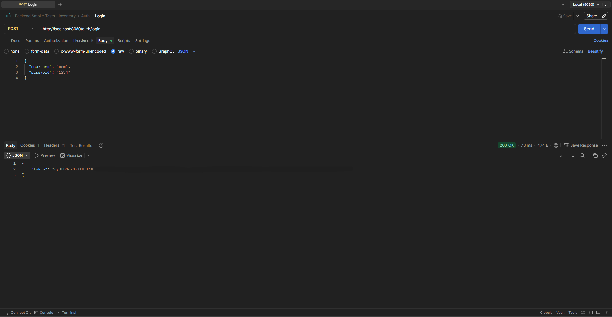
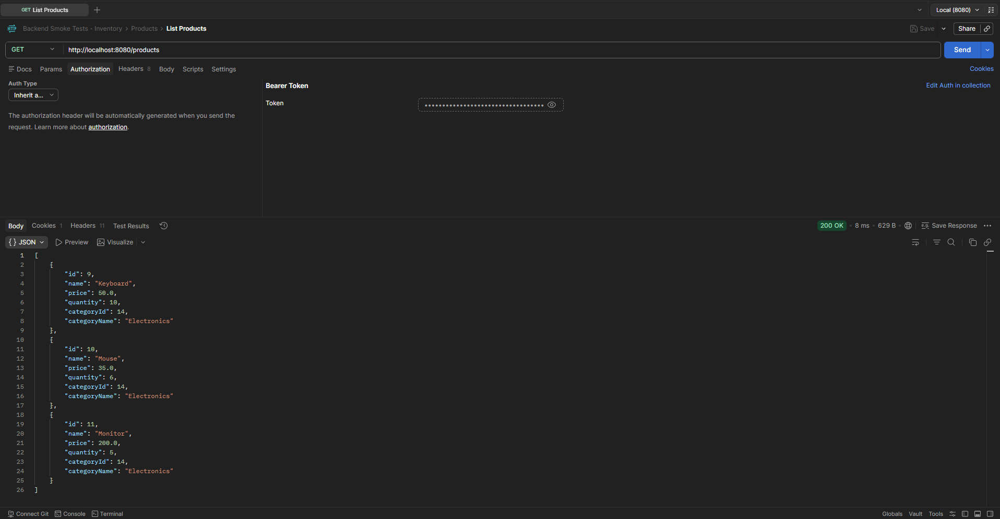

# Secure Inventory Management API

A REST API for managing inventory, featuring JWT-based authentication, role-based security, and full CRUD operations for products and categories.

## Screenshots

### Login


### Products (Authenticated)


## Features
- User registration and login
- JWT authentication (stateless)
- Password hashing using BCrypt
- CRUD operations for products and categories
- Search and filtering functionality
- Global exception handling

## Tech Stack
- Java
- Spring Boot
- Spring Security
- PostgreSQL
- JPA / Hibernate

## Architecture
This project follows a layered architecture:

- Controller → Handles HTTP requests
- Service → Business logic
- Repository → Database access
- DTO → Data transfer
- Security → JWT authentication

## Authentication Flow
1. User registers via `/auth/register`
2. User logs in via `/auth/login`
3. Server returns a JWT token
4. Token is sent in the `Authorization` header: Authorization: Bearer <token>
5. Protected endpoints validate the token before processing requests

## Example API Usage

### Register
**POST /auth/register**
    ```json
    {
        "username": "cam",
        "password": "1234"
    }

## Login
**POST /auth/login**
    ```json
    {
        "username": "cam"
        "password": "1234"
    }

## Get Products(Protected)
**GET /products**

- Header:  Authorization: Bearer <token>


## How to Run
1. Clone the repo:
    git clone https://github.com/cmudd37/inventory-management-api.git
    cd inventory-management-api

2. Configure PostgreSQL in (src/main/resources/application.properties):
    spring.datasource.url=jdbc:postgresql://localhost:5432/your_db
    spring.datasource.username=your_username
    spring.datasource.password=your_password

3. Run:
   mvn spring-boot:run

4. Test Endpoints: 
    Use Postman or any API client.

📌 Future Improvements:
Role-based authorization (admin/user roles)
Refresh tokens for JWT
Docker containerization
API documentation (OpenAPI)
Deployment to cloud (AWS)
